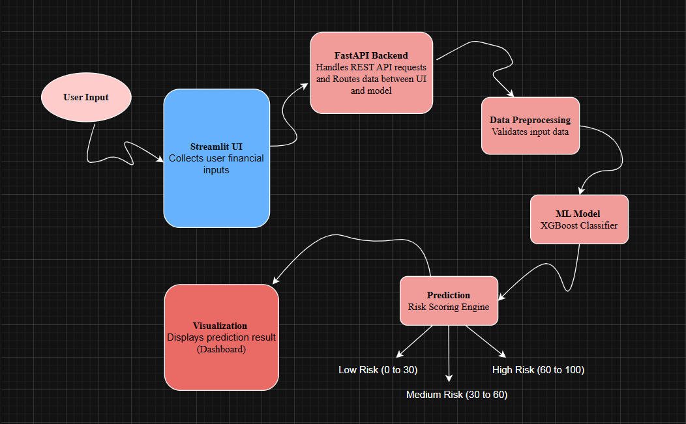
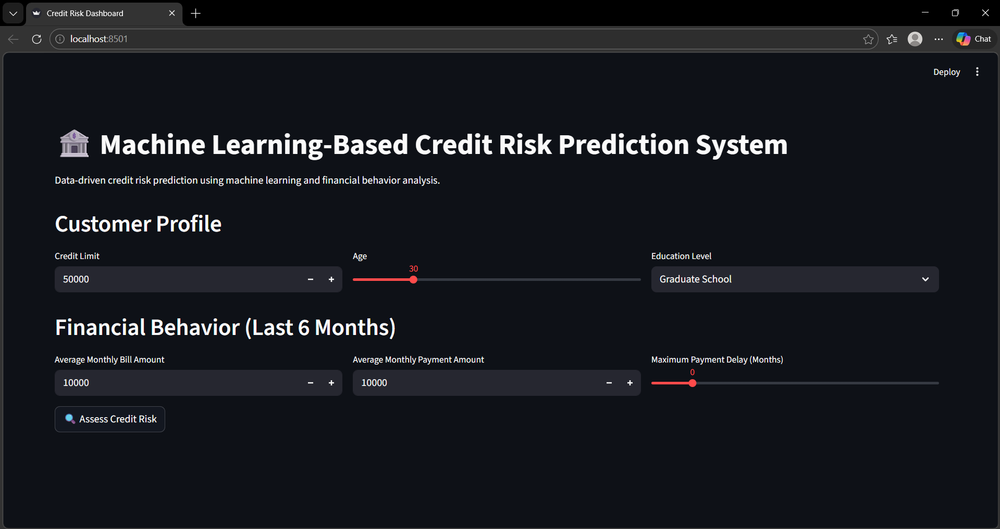
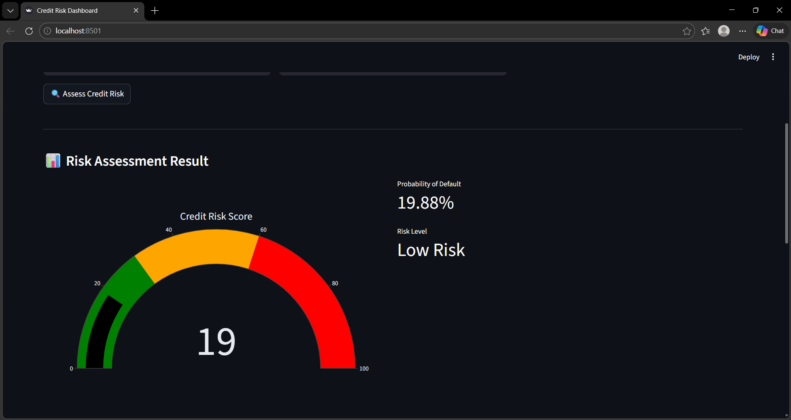
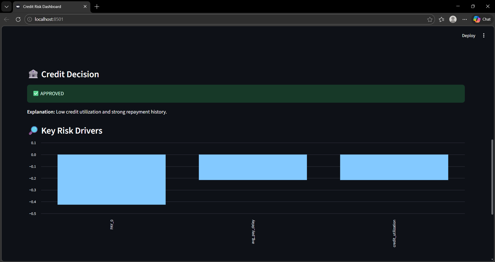
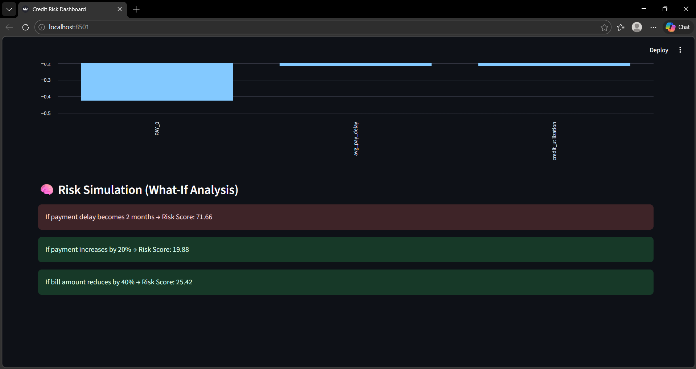

# 💳 ML-Based Credit Risk Prediction System

## 📌 Overview
This project predicts the probability of credit default using machine learning. It analyzes customer financial behavior such as credit limit, payment history, and billing patterns to classify users into risk categories.

The system is built as a full-stack ML application with a Streamlit dashboard, FastAPI backend, and an XGBoost model for prediction.

---

## 🎯 Objectives
- Predict customer credit risk (default probability)
- Apply ML techniques to financial data
- Provide real-time predictions via API
- Enable interactive risk analysis through a dashboard 

---

## 🔄 Workflow

---

## Output

